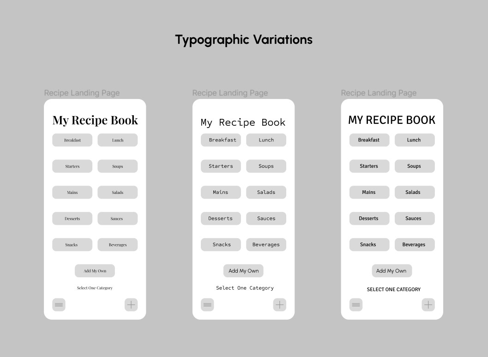
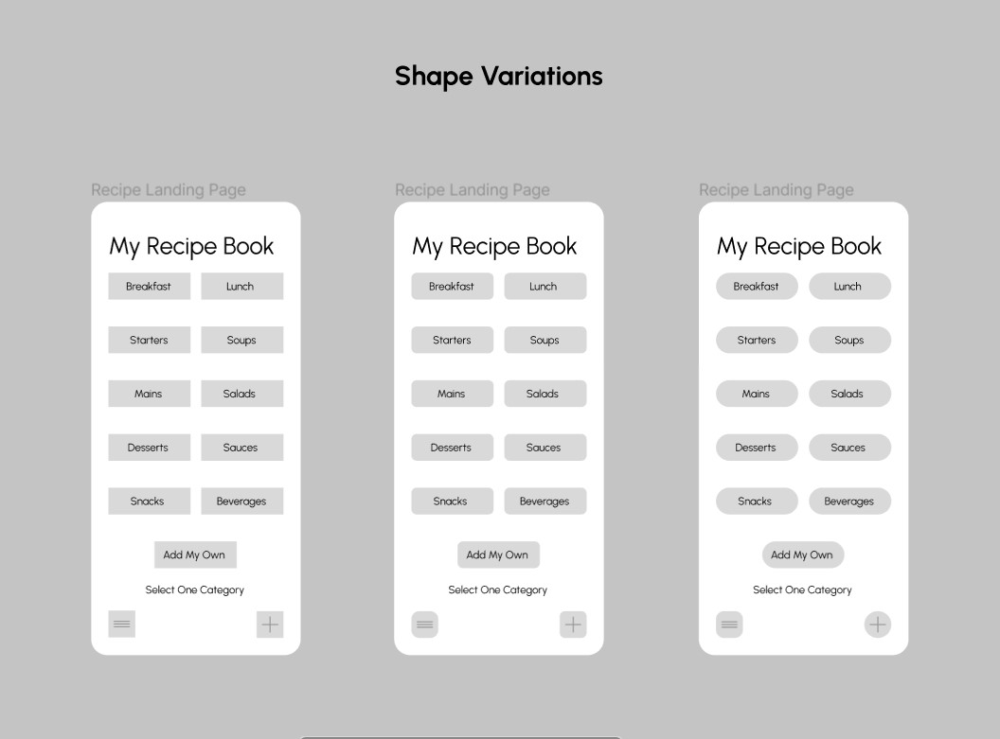
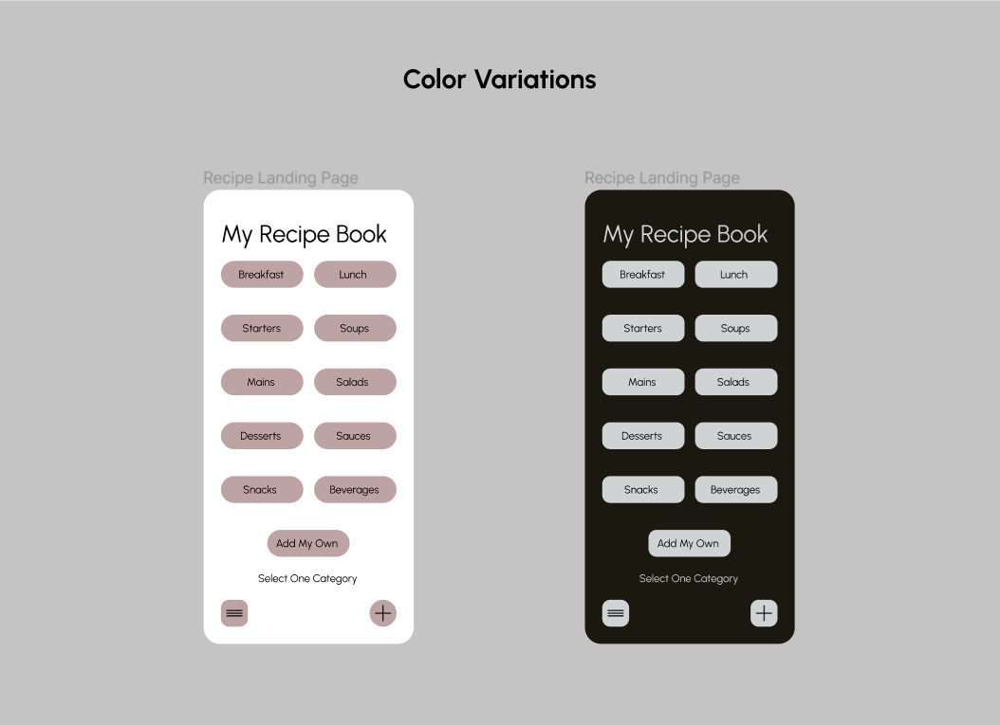
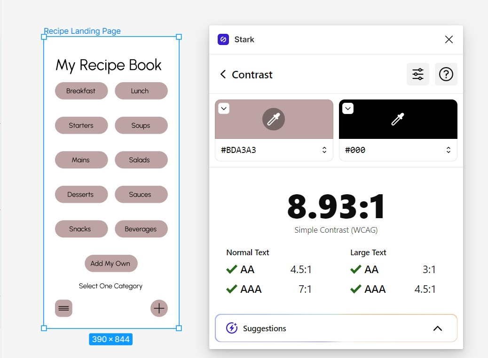
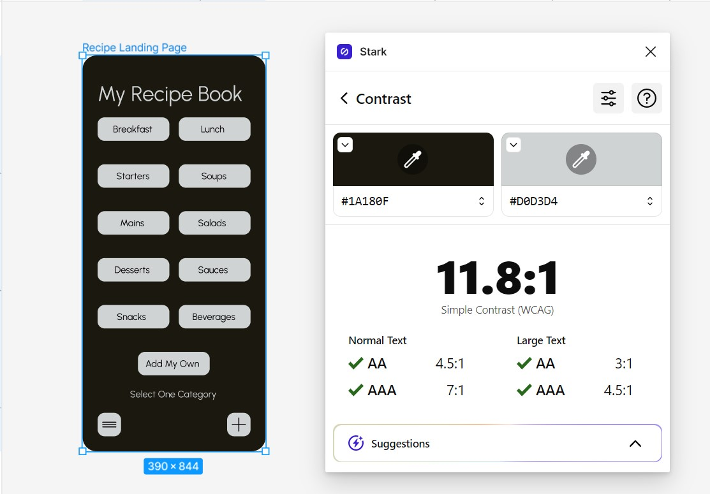
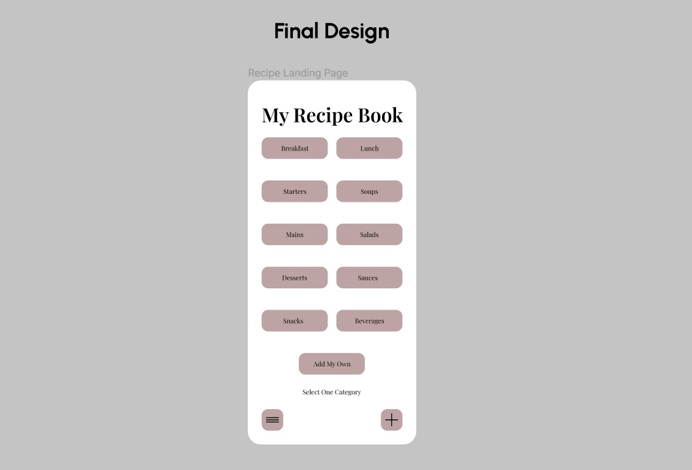
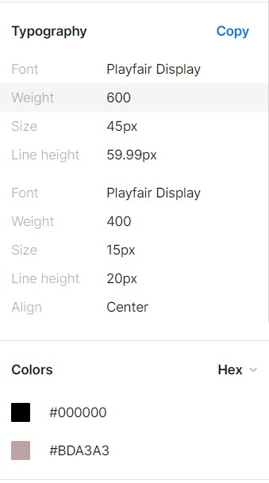
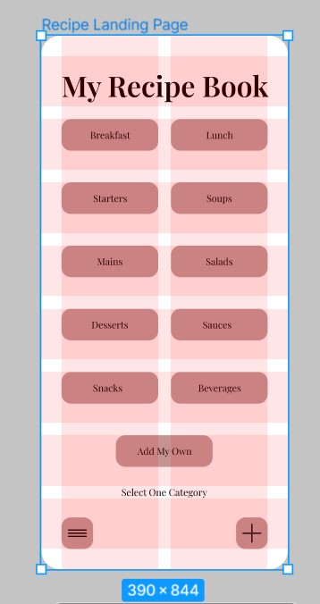

# Assignment 06: Interface Design, Samantha Alexis Manuel, DH110

## Description, Purpose, + Process
The purpose of this project is to provide families with a recipe-archiving app, in other words, a digital cookbook which they can access anytime, anyplace. The app is called “With Ingredients that Bind” and it includes the option to add collaborators and use templates for recording family recipes. 

The purpose and process of this interface design is to transform the previous low-fidelity designs I created into a digitized version with more style through the help of Figma. This version will be used with frames the size of the iPhone 13 screen. 

## Digitized Wireflow 
Please access the digitized wireflow [here](https://www.figma.com/file/4KN1fCa5r7IX7vht8ZwpEG/DH110---Assignment-06?type=design&node-id=0-1&t=PHL7AGLXS4tTG3DZ-0)

## Screen Design 
### Typographic Variations 

### Shape Variations 

### Color Variations 

## Impression Testing 
Please access the screen/audio recording [here](https://drive.google.com/file/d/143ypF1aC2lKjegE4DpbdTxd4epHI94yu/view?usp=sharing)

### 5 second test findings 
* Overall, the interviewee preferred and remembered the pink accents, general idea of the page, and the menu features on the bottom of the screen.
* Typography: They preferred the Playfair Display font the most
* Color: Thought the light mode of the wireframe was memorable rather than the dark mode
* Shape: Liked the slighly rounded edges the most out of the 3 different shapes 
* Overall, they thought there could be more ways to improve the app with more photos or icons 

## Accessibility + Contrast Check 
Evidence of accessibility (color-contrast at least) check

## Final Design + Design System 

## Design System 
**Typeface + Color Scheme**

**Layout Grid**

## Summary of Graphic Design + Decisions

*Typeface family and size:* 

I ended up taking the suggestion to use Playfair Display, 45pt and 15pt. Initially, I used Urbanist because I thought it was the cleanest, most legible font. I though that no matter what the sizing was, it would be clear to read. For the most part, I wanted the page to be easy to read and click through, hence the decision to use 45pt and 15pt. Overall, Playfair Display is great for its editorial nature and brings added dimension to the idea of "archiving" recipes. 

*Color Scheme:* 
* Background color: FFFFFF
* Text color: 000000
* Accent color: BDA3A3

The desision to use these particular colors came from the idea of matureness and approachability. I thought the accent color I chose was bright enough but muted in order to give it a more refined look. Since people of different generations would be using this app (at least college aged and above) I picked colors that would appeal most to the particular demographic rather than making it too playful and bright. 

*Layout grid and spacing*

For the layout grid, I used 2 columns x 8 rows. I found that this, used as a general guidline, would look more organized with all the buttons in 2 neat colums. I knew that I wanted to have 10 buttons along with the optional button to add your own category, text prompt, and navigation buttons below. This layout allowed me to take into account all the elements needed to have a functional but wholistic layout that allows the users to see everything at once without the need to scroll. 

